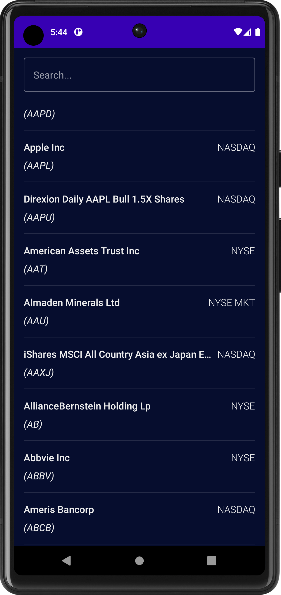
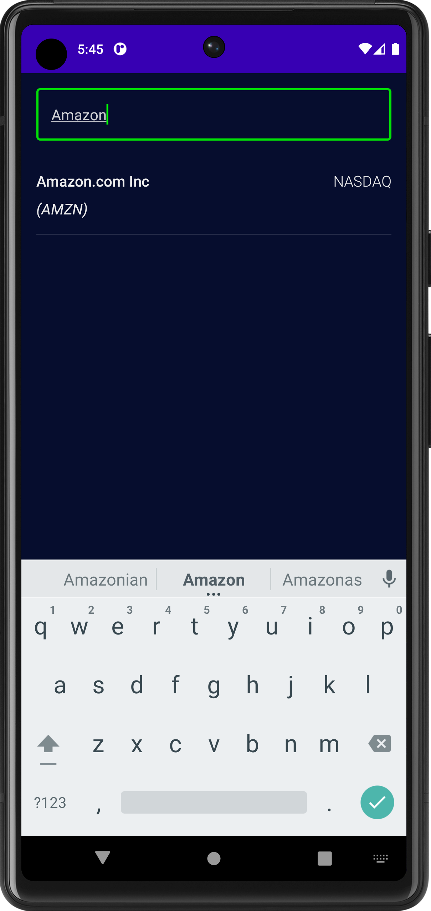
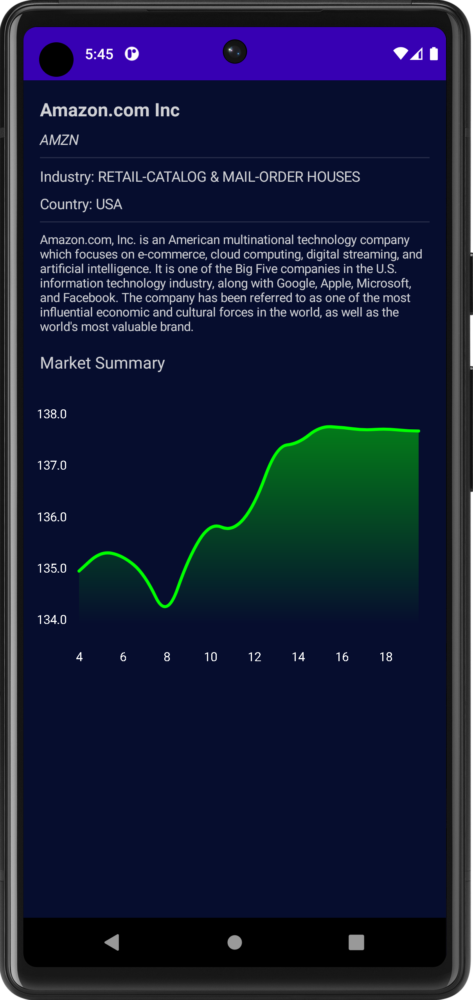

# StockMarketApp

**This is the stock overview app which lists all the stocks in US stock market with its details and summary.**

## Tech stack
 - Kotlin, Jetpack Compose, Dagger Hilt, Retrofit

## Features
 - Lists all the stocks listed in US stock market at NASDAQ and NYSE
 - Search option to filter the stocks with the query
 - Details of the stock such as Industry, Country and description
 - Price movement and Market summary described with the use of graph

## Screens
- **Stock List screen and search**

  
  

- **Stock Detail screen**

  

